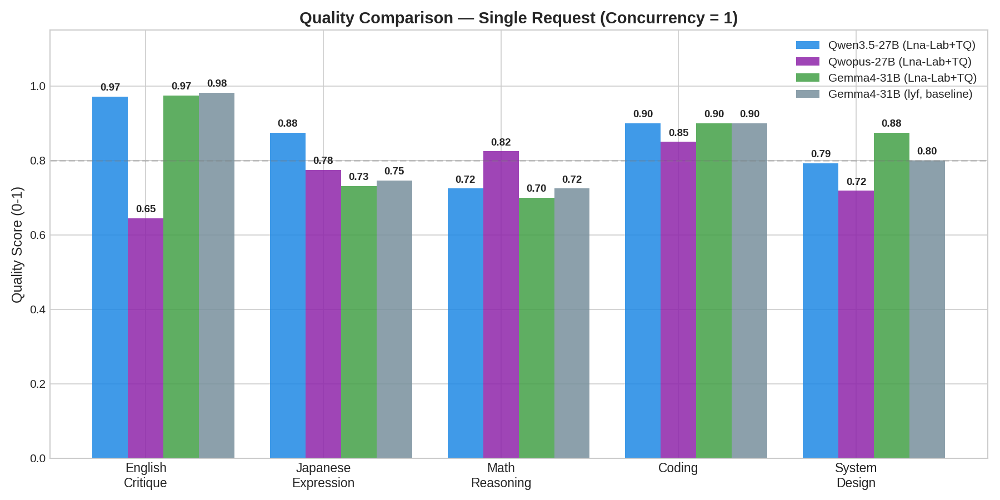
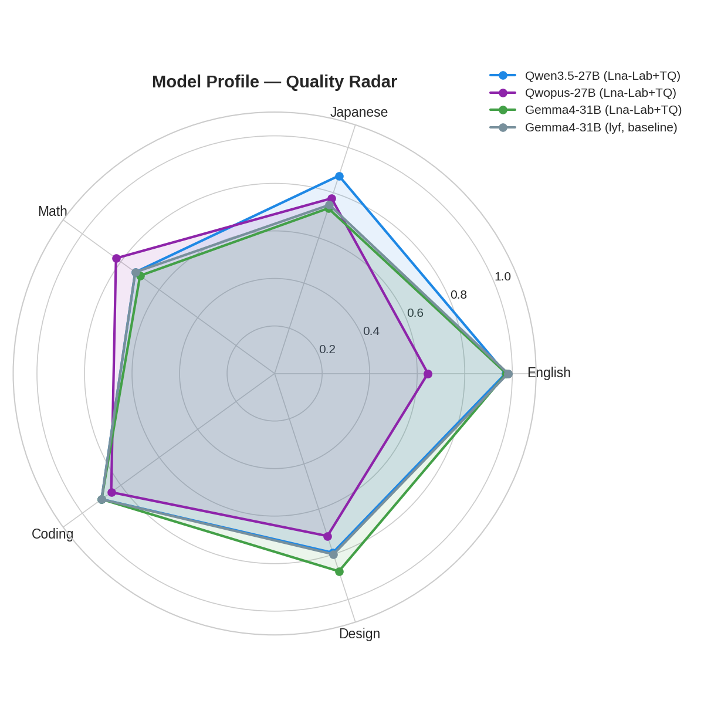
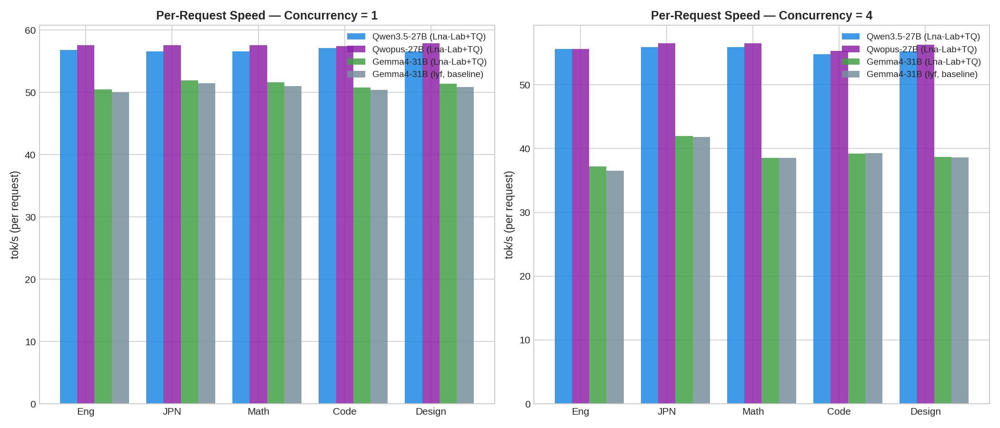
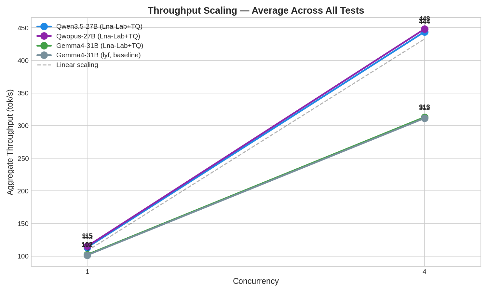
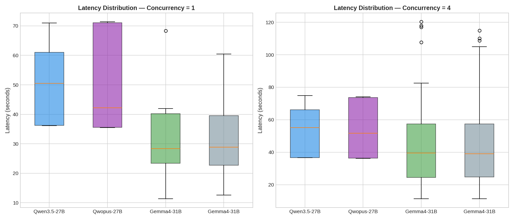
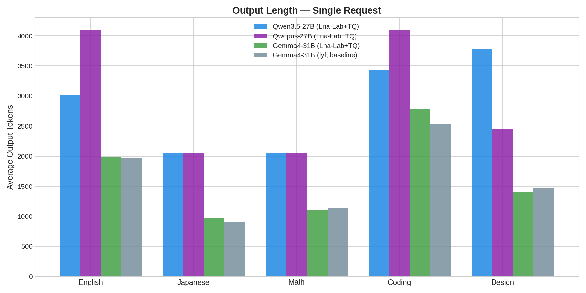

# Dense 27B/31B NVFP4 Comparative Benchmark

**Four dense NVFP4 models — two architectures, two quantization sources — tested head-to-head on NVIDIA RTX PRO 6000 Blackwell.**

## Models Tested

| Model | Params | Source | Size | Port |
|-------|--------|--------|------|------|
| **Qwen3.5-27B** | 27B | [Lna-Lab](https://huggingface.co/sakamakismile/Huihui-Qwen3.5-27B-abliterated-NVFP4) | 20.6 GB | 8016 |
| **Qwopus3.5-27B** | 27B | [Lna-Lab](https://huggingface.co/sakamakismile/Huihui-Qwopus3.5-27B-v3-abliterated-NVFP4) | 19.8 GB | 8017 |
| **Gemma4-31B** | 31B | [Lna-Lab](https://huggingface.co/sakamakismile/Huihui-gemma-4-31B-it-abliterated-v2-NVFP4) | 20.5 GB | 8018 |
| **Gemma4-31B (lyf)** | 31B | [Community](https://huggingface.co/lyf/Huihui-gemma-4-31B-it-abliterated-v2-NVFP4) | 20.5 GB | 8019 |

All models are abliterated (uncensored) NVFP4.

## Hardware & Configuration

| | |
|---|---|
| **GPU** | NVIDIA RTX PRO 6000 Blackwell (96 GB) — 1 GPU per model |
| **Context** | 8K tokens (quality test) / 128K tokens (VRAM test) |
| **CUDA Graph** | PIECEWISE mode |
| **Framework** | vLLM 0.19.1rc1 nightly (cu130) |

## Quality Results



### Scores by Test (Concurrency = 1)

| Test | Qwen3.5-27B | Qwopus-27B | Gemma4-31B | Gemma4-31B (lyf) | Winner |
|------|:-----------:|:----------:|:----------:|:----------------:|--------|
| **English Critique** | 0.72 | 0.65 | **0.98** | **0.98** | Gemma4 |
| **Japanese** | 0.74 | **0.77** | 0.73 | 0.75 | Qwopus |
| **Math Reasoning** | 0.75 | **0.83** | 0.70 | 0.73 | Qwopus |
| **Coding** | 0.80 | 0.85 | **0.90** | **0.90** | Gemma4 |
| **System Design** | 0.79 | 0.72 | **0.88** | 0.80 | Gemma4 (Lna-Lab) |



### Key Findings

1. **Gemma4-31B dominates English and Coding** (0.98 / 0.90) — 31B full-parameter activation gives deeper prose and code.
2. **Qwopus leads Math and Japanese** (0.83 / 0.77) — Opus distillation sharpens reasoning at any token length.
3. **Lna-Lab vs lyf Gemma4-31B: nearly identical quality** — same base model, same quantization method, same results.
4. **Qwen3.5-27B is the balanced all-rounder** — no weak spots, best throughput scaling.

## Speed Results



### Per-Request Speed (tok/s)

| Model | x1 | x4 (per-req) | x4 (aggregate) | Scaling |
|-------|:--:|:------------:|:--------------:|:-------:|
| Qwen3.5-27B | 57 | 55 | 443 | **7.8x** |
| Qwopus-27B | 58 | 56 | 448 | **7.7x** |
| Gemma4-31B | 51 | 38 | 309 | 6.0x |
| Gemma4-31B (lyf) | 51 | 38 | 310 | 6.1x |

**Qwen3.5 scales 30% better** at 4x concurrency (7.8x vs 6.0x). MLA (Multi-head Latent Attention) compresses KV cache natively, leaving more VRAM for batching.



## VRAM Usage @ 128K Context

Measured with `gpu_memory_utilization=0.95`:

| Model | Architecture | KV Compression | VRAM @ 128K | Available for KV |
|-------|:------------|:--------------|:-----------:|:----------------:|
| Qwen3.5-27B | MLA | **Native (built-in)** | 92,034 MB | ~72 GB |
| Qwopus-27B | MLA | **Native (built-in)** | 92,034 MB | ~72 GB |
| Gemma4-31B | Standard MHA | None (FP16) | 94,210 MB | ~74 GB |
| Gemma4-31B (lyf) | Standard MHA | None (FP16) | 94,210 MB | ~74 GB |

**MLA saves ~2.2 GB** over standard MHA at 128K context. This advantage compounds at higher concurrency — explaining why Qwen3.5 achieves 7.8x scaling vs Gemma4's 6.0x.

### Architecture Comparison

| Aspect | Qwen3.5 (27B) | Gemma4 (31B) |
|--------|:-------------:|:------------:|
| English prose | Good (0.72) | **Excellent (0.98)** |
| Reasoning | Good (0.75) | Decent (0.70) |
| Speed | **57-58 tok/s** | 50-52 tok/s |
| MLA | **Yes** | No |
| MTP | Yes (Qwen only) | No |
| Concurrency scaling | **7.8x** | 6.0x |
| Context | 262K | 262K |





## Which Model Should You Use?

| Use Case | Recommended | Why |
|----------|-------------|-----|
| **English / essays** | Gemma4-31B | 0.98 quality |
| **Math reasoning** | Qwopus-27B | 0.83, Opus distillation |
| **Coding** | Gemma4-31B | 0.90, structured output |
| **Japanese** | Qwopus-27B | 0.77, best multilingual |
| **All-rounder** | Qwen3.5-27B | No weak spots + MTP + MLA |
| **Max throughput** | Qwen3.5-27B | 7.8x scaling at x4 concurrency |

## Reproducibility

```bash
git clone https://github.com/lna-lab/27b-31b-nvfp4-bench
cd 27b-31b-nvfp4-bench
docker compose -f docker-compose.bench.yml up -d
pip install aiohttp
python bench.py
pip install matplotlib
python generate_figures.py
```

## License

Benchmark code: MIT. Models subject to their respective licenses (Qwen / Gemma).

## Credits

- Models: [huihui-ai](https://huggingface.co/huihui-ai), [Jackrong](https://huggingface.co/Jackrong), [Google](https://huggingface.co/google), [Qwen](https://huggingface.co/Qwen)
- Community baseline: [lyf](https://huggingface.co/lyf)
- Quantization: [llm-compressor](https://github.com/vllm-project/llm-compressor)
- Benchmark: [Lna-Lab](https://github.com/lna-lab)
